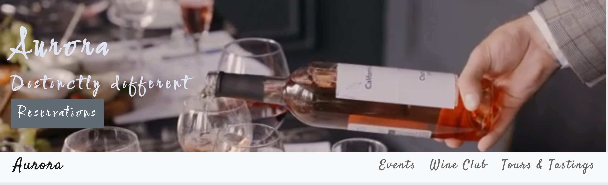
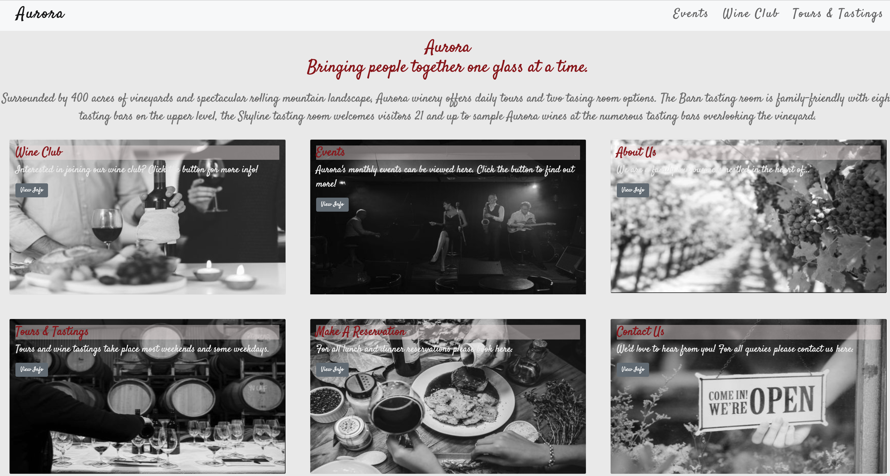

# Aurora

## Aurora

A website created for a winery utilising Bootstrap 5, CSS , HTML.
Site can be viewed here:
https://aurora-winery.netlify.app/

Includes Homepage Navigation Section:

Features Events Page:

Wine Club Page:

Feedback Form:

### Credits

All images and videos, available for public use, were sourced from pexels.com. 
This project does not claim any ownership or credit over the images.
Images are available to download here:

Photos and videos by Pavel Danilyuk from Pexels
https://www.pexels.com/photo/a-person-holding-wine-bottles-8775071/
https://www.pexels.com/video/person-pouring-wine-in-a-wine-glass-8764784/
https://www.pexels.com/photo/clear-wine-glasses-on-table-8775048/

Photos and videos by cottonbro from Pexels
https://www.pexels.com/photo/music-band-performing-on-stage-9419224/

Photo by Amina Filkins from Pexels
https://www.pexels.com/photo/crop-person-showing-signboard-on-window-5410138/

Photo by Jill Wellington from Pexels
https://www.pexels.com/photo/grapes-on-vineyard-during-daytime-39351/

Photo by Bernyce Hollingworth from Pexels
https://www.pexels.com/photo/clear-wine-glass-2702805/

Video by Taryn Elliott from Pexels
https://www.pexels.com/video/aerial-of-agricultural-lands-and-mountains-6922683/
